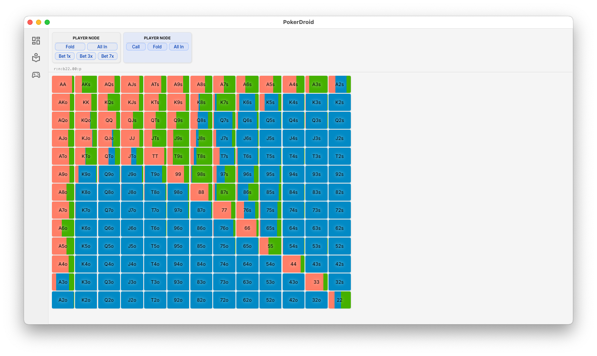

# Poker Solver CFR



Based on [Tim's](https://github.com/timpalpant/go-cfr) work I build solver using CFR.
In this repo you can find tools to build card abstraction and run CFR on full headup game.

- It is using card abstraction with EMD equity clustering and isomorphism
- Its has implementation of poker table 
- Fast card eval
- Slumbot benchmark
- Implments UI for tree visualisation
- CFR with sampling + baselines, using CFRD/CFR+
- Kuhn implementation
- Includes API and server to search/navigate solution
- Takes advantage of go concurrency and doesnt use gc much
- Search (WIP)


## How to run

Start with card abstraction:

### Build equities:

```
go run cmd/main.go clustering equities --output equities.bin
```

```
go run cmd/main.go clustering river --clusters 400 --equities ./equities.bin --output ./river_400.bin
```

```
go run cmd/main.go clustering river --clusters 400 --equities ./equities.bin --output ./river_400.bin
```

```
go run cmd/main.go clustering turn --equities ./equities.bin  --output ./turn_400.bin --clusters 400 --maxiter 200
```

```
go run cmd/main.go clustering flop --equities ./equities.bin --output ./flop_400.bin --clusters 400
```


### Pack abstraction to single file

```
go run cmd/main.go clustering pack --flop ./flop_400.bin --turn ./turn_400.bin --river ./river_400.bin --output ./pack_400.bin
```


### Run CFR

```
go run cmd/main.go cfr train mc --depth 20 --abs ./pack_400.bin --output ./20_bb_experiment
```

Will produce following output:

```
2025/05/21 07:54:47 loading abstraction
2025/05/21 07:54:48 experiment: mc
2025/05/21 07:54:48 abs: 7cd92b9a-5725-4985-973a-e8ab100fff60
2025/05/21 07:54:48 GameParams{
 Players:2
 MaxActions:12
 SB:1.000000
 BetSizes:[[0.5 1 3 7]]
 MinBet:false
 Stacks:40.000000, 40.000000,
}
07:54:48 starting trainer
07:54:52 ep: 1      | it: 26121222   | it/s: 7034052 | up/s: 15702663 | sts: 201139  | nodes: 2298    | exp: 10.11729684 | ev: 0.000589209
....
08:09:58 ep: 200    | it: 4715492051 | it/s: 5123089 | up/s: 20119867 | sts: 349123  | nodes: 2298    | exp: 10.06058264 | ev: -0.001573859
....
08:11:20 saving policies
08:11:21 building profile
08:11:24 ep: 201    | it: 5150536954 | it/s: 5093845 | up/s: 30980373 | sts: 349221  | nodes: 2298    | exp: 10.07928196 | ev: -0.001070745
...
```

## UI

pokerdoid comes with Ui build using webview. Given tree:
```
├── clustering
│   ├── equities.bin
│   └── pack_400.bin
└── solutions
    └── tree_20bb.bin
```

You can run:

```
go run cmd/studio/main.go dev --dir path/to/dir --abs pack_400.bin
```

